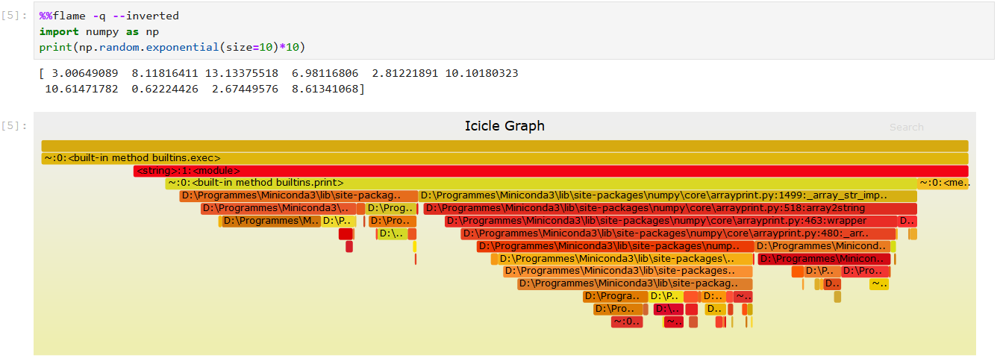

# Jupyterflame

[Flamegraphs](http://www.brendangregg.com/flamegraphs.html) are a visualization of profiled software, allowing the most frequent code-paths to be identified quickly and accurately.

**Jupyterflame** will let you create flamegraphs inside jupyter notebooks. It will performs a `%prun` command in your cell and use the output to create a flamegraph.

### Installation
------------------
The latest version of this package can currently be installed from this repo with the following command:
```
pip install git+https://github.com/H4dr1en/jupyterflame.git
```
Dependencies: 
- Perl, that can be installed in a conda environnment with:

```
conda install -c anaconda perl
```
- Windows users: as long as [this PR](https://github.com/baverman/flameprof/pull/5) is not merged, you will have to install [this package](https://github.com/H4dr1en/flameprof "this package") for compatibility:

```
pip install git+https://github.com/H4dr1en/flameplot.git
```

### Usage
------------
To generate flamegraphs inside jupyter notebooks, simple enable it using:

    %load_ext jupyterflame

This will register the `%flame` and  `%%flame` [ ipython magic commands](https://ipython.readthedocs.io/en/stable/interactive/magics.html) that you can now use to create flamegraphs in any cell of your notebook.

### API
---------
`%flame` and  `%%flame` ipython magic commands are wrappers around `%prun`. Therefore all parameters of `%prun` are compatible with `%flame` and  `%%flame`.

[Flamegraph.pl](https://github.com/brendangregg/FlameGraph#options) parameters are also available in order to customize the flamegraph.

Example:


### Current limitations
---------------------------
- Limitations relative to the `%prun` command
- The generated flamegraphs use javascript and html unique ids to be interactive, therefore only one flamegraph can be created at a time.

### Contributions
---------------------
Contributions are welcomed!